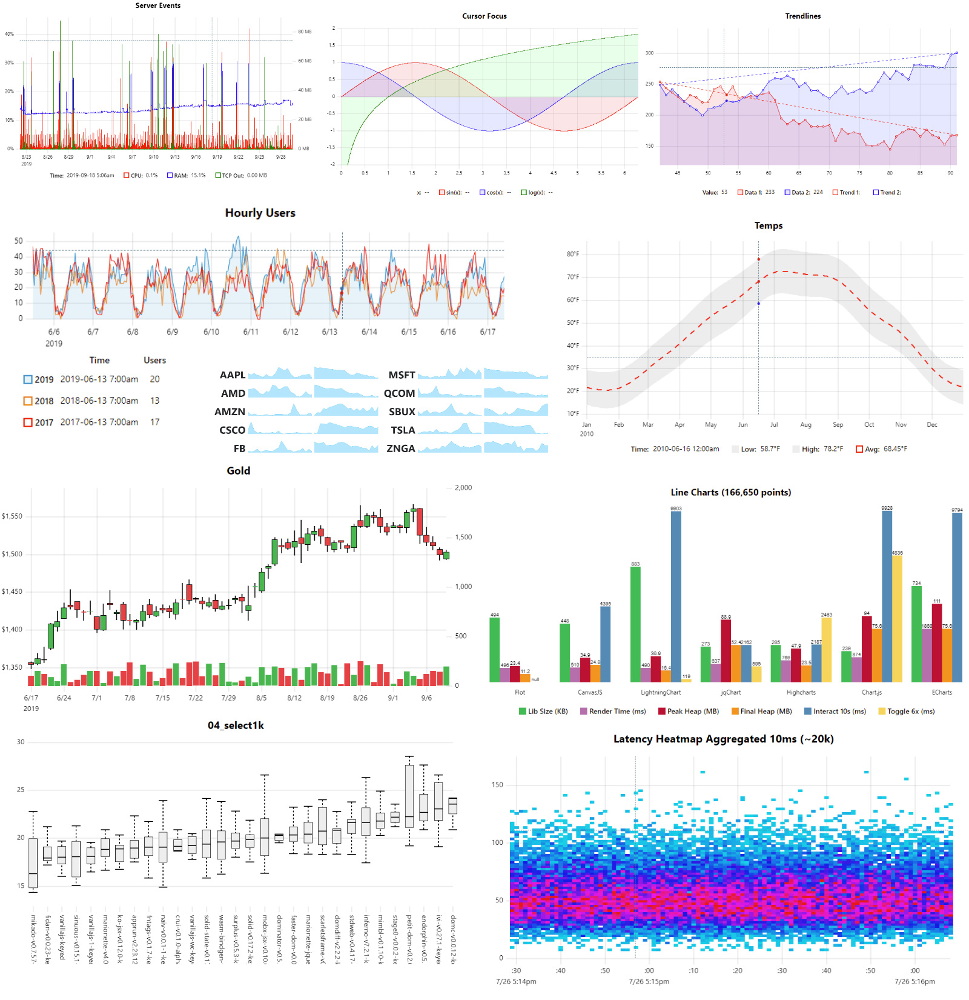

## 📈 μPlot

An [exceptionally fast](#performance), tiny ([~10 KB min](https://github.com/leeoniya/uPlot/tree/master/dist/uPlot.iife.min.js)) time series chart _(MIT Licensed)_

---
### Introduction

μPlot is a [fast, memory-efficient](#performance) [time series](https://en.wikipedia.org/wiki/Time_series) chart based on [Canvas 2D](https://developer.mozilla.org/en-US/docs/Web/API/CanvasRenderingContext2D); from a cold start it can create an interactive chart containing 150,000 data points in 40ms. In addition to fast initial render, the zooming and cursor performance is by far the best of any similar charting lib; at ~10 KB, it's likely the smallest and fastest time series plotter that doesn't make use of WebGL shaders or WASM, both of which have much higher startup cost and code size.

<h3 align="center">166,650 point bench: <a href="https://leeoniya.github.io/uPlot/bench/uPlot.html">https://leeoniya.github.io/uPlot/bench/uPlot.html</a></h3>

---


---
### 🚧 UNDER CONSTRUCTION 🚧

**2019-10-24:** μPlot is now mostly feature-complete and its declarative `opts` API is in pretty good, future-accommodating shape. Its imperative API, docs and additional examples are still in progress.

v1.0 and API stabilization are loosely targetted for sometime before 2020-01-01. Until then, feedback, feature suggestions and real use-cases can be submitted to the issue tracker for consideration & further discussion.

---
### Features

- Multiple series w/toggle
- Multiple y-axes, scales & grids
- Temporal or numeric x-axis
- Line styles (color, width, dash)
- Zoom with auto-rescale
- Legend with live values
- [Support for missing data](https://leeoniya.github.io/uPlot/demos/missing-data.html)
- [Cursor sync for multiple charts](https://leeoniya.github.io/uPlot/demos/sync-cursor.html)
- [Data streaming (live update)](https://leeoniya.github.io/uPlot/demos/stream-data.html)
- [High / Low bands](https://leeoniya.github.io/uPlot/demos/high-low-bands.html)

---
### Non-Features

In order to stay lean, fast and focused the following features will not be added:

- No data parsing, aggregation, summation or statistical processing - just do it in advance. e.g. https://simplestatistics.org/, https://www.papaparse.com/
- No transitions or animations - they're always pure distractions.
- No DOM measuring; uPlot does not know how much space your dynamic labels & values will occupy, so requires explicit sizing and/or some CSS authoring.
- No [area fills](https://www.chartphp.com/wp-content/uploads/area.png), [stacked series](https://everydayanalytics.ca/2014/08/stacked-area-graphs-are-not-your-friend.html) or [line smoothing](http://www.vizwiz.com/2011/12/when-you-use-smoothed-line-chart-your.html). See links for how these are each terrible at actually communicating information.
- Probably no drag scrolling/panning. Maintaining good perf with huge datasets would require a lot of extra code & multiple `<canvas>` elements to avoid continuous redraw and rescaling on each dragged pixel. However, since uPlot's performance allows rendering of very wide canvases, they can be scrolled naturally with CSS's `overflow-x: auto` applied to a narrower containing element. Pagination of data also works well.

---
### Usage & API

Example: https://jsfiddle.net/oh0xtzn5/

```html
<link rel="stylesheet" href="src/uPlot.css">
<script src="dist/uPlot.iife.min.js"></script>
<script>
    const data = [
        [1566453600, 1566457260, 1566460860, 1566464460],   // Unix timestamps
        [0.54,       0.15,       3.27,       7.51      ],   // CPU
        [12.85,      13.21,      13.65,      14.01     ],   // RAM
        [0.52,       1.25,       0.75,       3.62      ],   // TCP Out
    ];

    const opts = {
        width: 800,
        height: 400,
        series: {
            y: [
                {
                    label: "CPU",
                    scale: "%",
                    value: v => v.toFixed(1) + "%",
                    color: "red",
                    width: 2,
                    dash: [10, 5],
                },
                {
                    label: "RAM",
                    scale: "%",
                    value: v => v.toFixed(1) + "%",
                    color: "blue",
                },
                {
                    label: "TCP Out",
                    scale: "mb",
                    value: v => v.toFixed(2) + "MB",
                    color: "green",
                }
            ],
        },
        axes: {
            y: [
                {
                    scale: '%',
                    values: (vals, space) => vals.map(v => +v.toFixed(1) + "%"),
                },
                {
                    side: 3,
                    scale: 'mb',
                    values: (vals, space) => vals.map(v => +v.toFixed(2) + "MB"),
                    grid: null,
                },
            ],
        },
    };

    let uplot = new uPlot(opts, data);

    document.body.appendChild(uplot.root);
</script>
```

---
### Performance

Benchmarks done on a ThinkPad T480S:

- Windows 10 x64, Chrome 78.0.3904.70
- Core i5-8350U @ 1.70GHz, 8GB RAM
- Intel HD 620 GPU, 2560x1440 res

<table>
    <thead>
        <tr>
            <th>Bench Demo</th>
            <th>Size (min)</th>
            <th>Render (167k)</th>
            <th>Total</th>
            <th>JS Heap</th>
            <th>Interact (10s)</th>
        </tr>
    </thead>
    <tbody>
        <tr>
            <td><a href="https://leeoniya.github.io/uPlot/bench/uPlot.html">uPlot</a></td>
            <td>10 KB</td>
            <td>39 ms</td>
            <td>71 ms</td>
            <td>19.1 MB</td>
            <td>154 ms</td>
        </tr>
        <tr>
            <td><a href="https://leeoniya.github.io/uPlot/bench/Flot.html">Flot</a></td>
            <td>2,606 KB</td>
            <td>130 ms</td>
            <td>190 ms</td>
            <td>42.7 MB</td>
            <td>--</td>
        </tr>
        <tr>
            <td><a href="https://leeoniya.github.io/uPlot/bench/dygraphs.html">dygraphs</a></td>
            <td>121 KB</td>
            <td>168 ms</td>
            <td>251 ms</td>
            <td>113 MB</td>
            <td>2569 ms</td>
        </tr>
        <tr>
            <td><a href="https://leeoniya.github.io/uPlot/bench/CanvasJS.html">CanvasJS</a></td>
            <td>448 KB</td>
            <td>295 ms</td>
            <td>414 ms</td>
            <td>49.2 MB</td>
            <td>2401 ms</td>
        </tr>
        <tr>
            <td><a href="https://leeoniya.github.io/uPlot/bench/jqChart.html">jqChart</a></td>
            <td>270 KB</td>
            <td>450 ms</td>
            <td>577 ms</td>
            <td>142 MB</td>
            <td>600 ms</td>
        </tr>
        <tr>
            <td><a href="https://leeoniya.github.io/uPlot/bench/ECharts.html">ECharts</a></td>
            <td>734 KB</td>
            <td>513 ms</td>
            <td>765 ms</td>
            <td>179 MB</td>
            <td>2194 ms</td>
        </tr>
        <tr>
            <td><a href="https://leeoniya.github.io/uPlot/bench/Highcharts.html">Highcharts</a></td>
            <td>270 KB</td>
            <td>573 ms</td>
            <td>717 ms</td>
            <td>71.7 MB</td>
            <td>1122 ms</td>
        </tr>
        <tr>
            <td><a href="https://leeoniya.github.io/uPlot/bench/Chart.js.html">Chart.js</a></td>
            <td>153 KB</td>
            <td>862 ms</td>
            <td>957 ms</td>
            <td>115 MB</td>
            <td>5408 ms</td>
        </tr>
        <tr>
            <td><a href="https://leeoniya.github.io/uPlot/bench/ApexCharts.html">ApexCharts</a></td>
            <td>430 KB</td>
            <td>1269 ms</td>
            <td>2441 ms</td>
            <td>142 MB</td>
            <td>7559 ms</td>
        </tr>
        <tr>
            <td><a href="https://leeoniya.github.io/uPlot/bench/ZingChart.html">ZingChart</a></td>
            <td>682 KB</td>
            <td>2324 ms</td>
            <td>2518 ms</td>
            <td>220 MB</td>
            <td>--</td>
        </tr>
        <tr>
            <td><a href="https://leeoniya.github.io/uPlot/bench/amCharts.html">amCharts</a></td>
            <td>1,034 KB</td>
            <td>6514 ms</td>
            <td>6730 ms</td>
            <td>397 MB</td>
            <td>7539 ms</td>
        </tr>
        <tr>
            <td>Chartist.js</td>
            <td>--</td>
            <td>--</td>
            <td>--</td>
            <td>--</td>
            <td>--</td>
        </tr>
        <tr>
            <td>C3.js (d3-based)</td>
            <td>--</td>
            <td>--</td>
            <td>--</td>
            <td>--</td>
            <td>--</td>
        </tr>
        <tr>
            <td>dc.js (d3-based)</td>
            <td>--</td>
            <td>--</td>
            <td>--</td>
            <td>--</td>
            <td>--</td>
        </tr>
        <tr>
            <td>Plotly (d3-based)</td>
            <td>--</td>
            <td>--</td>
            <td>--</td>
            <td>--</td>
            <td>--</td>
        </tr>
        <tr>
            <td>MetricsGraphics (d3-based)</td>
            <td>--</td>
            <td>--</td>
            <td>--</td>
            <td>--</td>
            <td>--</td>
        </tr>
        <tr>
            <td>rickshaw (d3-based)</td>
            <td>--</td>
            <td>--</td>
            <td>--</td>
            <td>--</td>
            <td>--</td>
        </tr>
    </tbody>
</table>

---
### Acknowledgements

- Dan Vanderkam's [dygraphs](https://github.com/danvk/dygraphs) was a big inspiration; in fact, my stale [pull request #948](https://github.com/danvk/dygraphs/pull/948) was a primary motivator for μPlot's inception.
- Adam Pearce for [#15 - remove redundant lineTo commands](https://github.com/leeoniya/uPlot/issues/15).